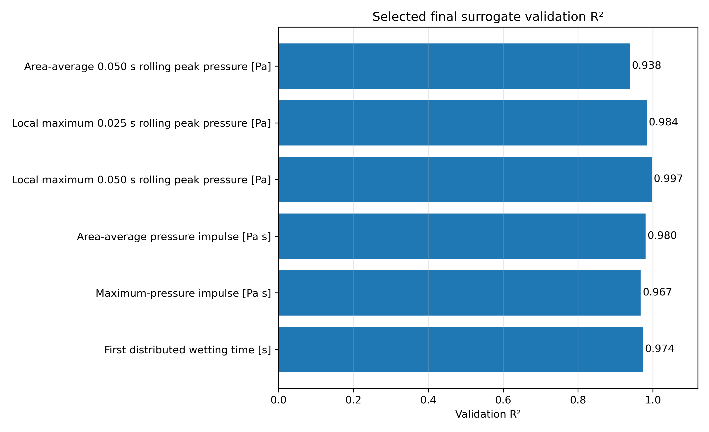
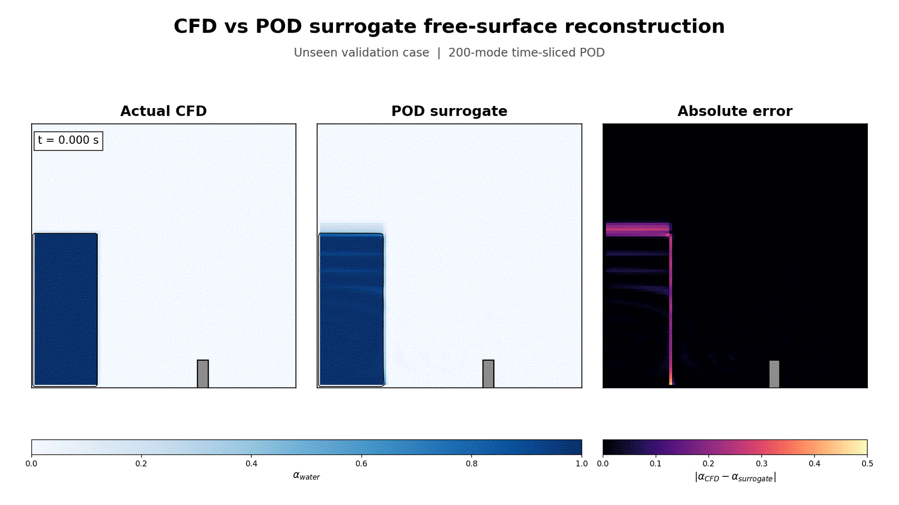

# Automated OpenFOAM VOF Simulation and Surrogate Modelling of Dam-Break Impact Loads on an Obstacle

**A two-page summary.** Every figure, table and caveat is in
[RESULTS.md](RESULTS.md); the code and how to run it are in
[README.md](README.md).

---

## Problem

A collapsing water column surges along a channel and strikes an obstacle. The
load it delivers (peak pressure, pressure impulse, wetting time) depends on
the water-column height `H` and on the obstacle's height `h` and position `x`,
and every design point costs a transient two-phase CFD run. The question:

> Which impact loads can a surrogate trained on a designed CFD database
> predict on **unseen geometries**, and how well can a **reduced-order field
> model** reproduce the evolving free surface?

**Pipeline:** OpenFOAM `interFoam` (laminar, 2-D, VOF) → 403-case design
(7 × 7 × 7 training grid + 60 off-grid Latin-hypercube validation cases) →
automated case generation and batch CFD (403/403 completed) → robust impact
metrics → scalar surrogates and a POD field surrogate → validation on the 60
unseen geometries.

---

## Key results

### 1. A complete, automated CFD database

All 403 cases are generated from one committed OpenFOAM template, run to
1.5 s and post-processed without manual intervention. Every run completed,
every mesh passed `checkMesh`, and every case's metrics were extracted. The
design regenerates exactly from its seed.

### 2. Integrated and time-windowed loads are highly predictable

| Target (60 unseen geometries) | Selected model | R² | nRMSE |
|---|---|---:|---:|
| Local max, 0.050 s rolling peak pressure | poly3 ridge | **0.997** | 1.5 % |
| Area-average pressure impulse | poly3 ridge | **0.980** | 3.7 % |
| First distributed wetting time | Gaussian process | **0.974** | 5.3 % |
| Area-average 0.050 s rolling peak pressure | RBF SVR | **0.938** | 6.2 % |



### 3. Instantaneous-style peaks are not — and that is physics, not modelling

The same pressure signal becomes steadily less predictable as the peak
definition narrows: area-average 0.050 s rolling peak R² 0.94 → 0.025 s
rolling peak 0.58; top-5 % mean 0.71 → top-1 % mean **0.15**. The
short-lived peak is set by splash events that three geometric inputs do not
determine. The practical conclusion is to design against integrated or
time-windowed loads, which a cheap surrogate predicts to a few percent.

### 4. The POD field surrogate captures the surge, not the sharp interface

A 200-mode POD basis (93.6 % variance) with a per-time-slice KNN coefficient
map reconstructs `alpha.water` on 3 660 unseen snapshots with mean α-RMSE
**0.091**, water-region IoU **0.85** and **1.8 %** volume error. The error
peaks during the obstacle impact, where the moving interface is least
low-rank.



---

## Honest limitations

- **2-D, laminar, one mesh**; no mesh-independence study of the impact
  pressures.
- **Model selection uses the validation set** (best of 20 candidates per
  target), so the reported R² values are mildly optimistic; there is no
  separate test set.
- The surrogates **interpolate within** the sampled `(H, h, x)` box; obstacle
  width and fluid properties are fixed.
- The ~27 GB CFD database is not redistributed. The extracted metrics are
  committed, so the surrogates can be re-trained without it.

---

## Reproduce

```bash
pip install -r requirements.txt pytest
python -m pytest -q                               # design + case generation + metrics
python scripts/train_robust_surrogate_models.py   # scalar surrogates from committed metrics
scripts/run_all.sh                                # full pipeline (needs OpenFOAM v2312)
```

To render this report as a PDF (once `pandoc` and a LaTeX engine are
installed):

```bash
pandoc REPORT.md -o REPORT.pdf --resource-path=.
```
