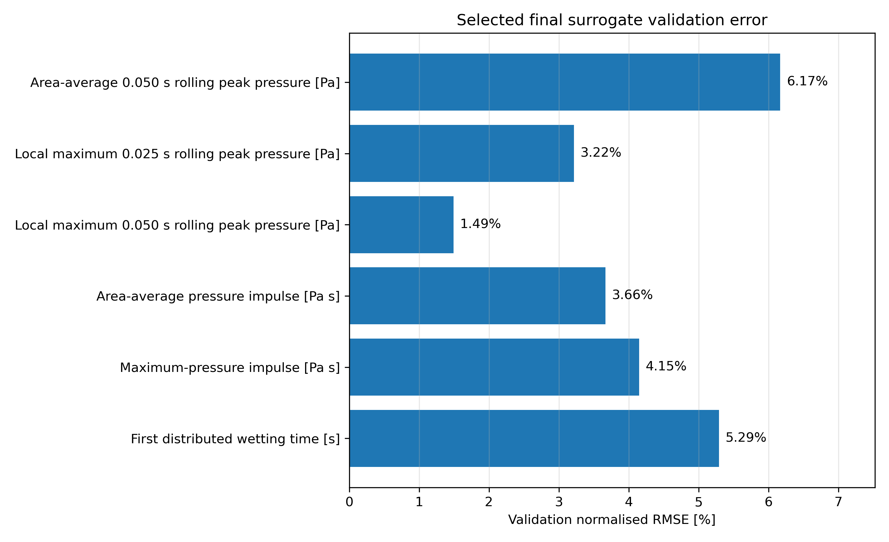
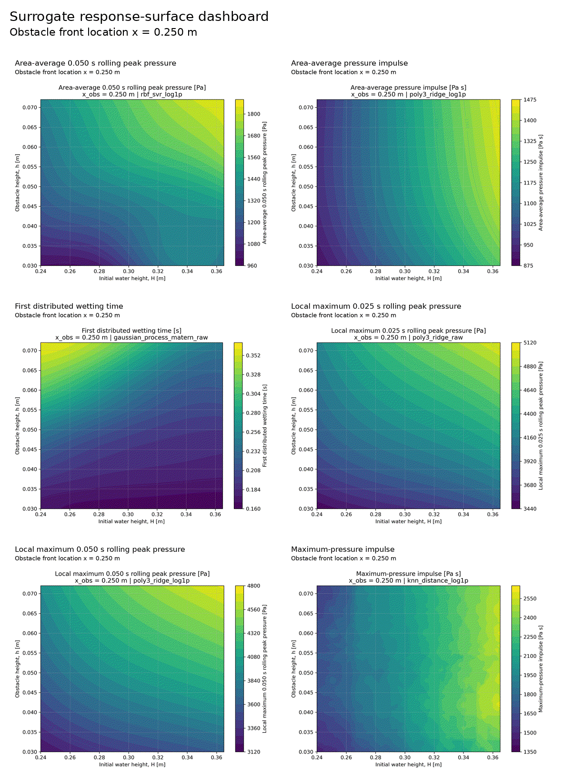
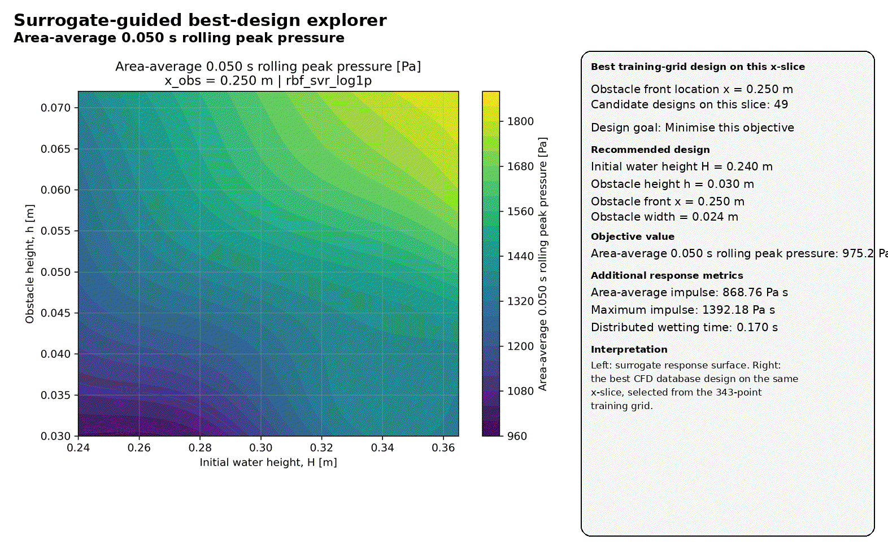
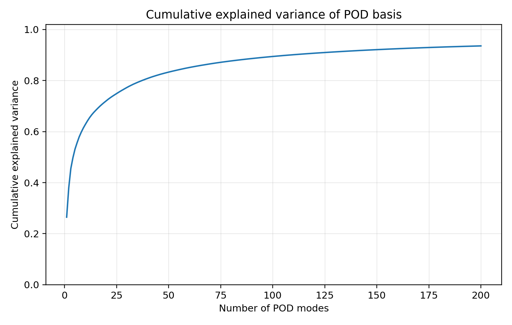
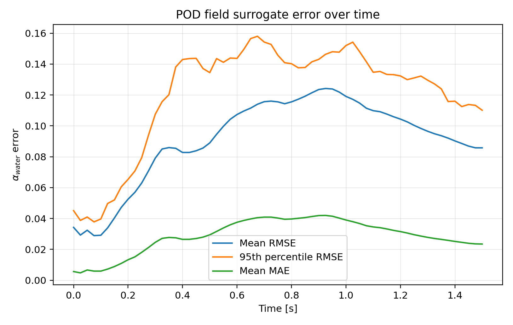
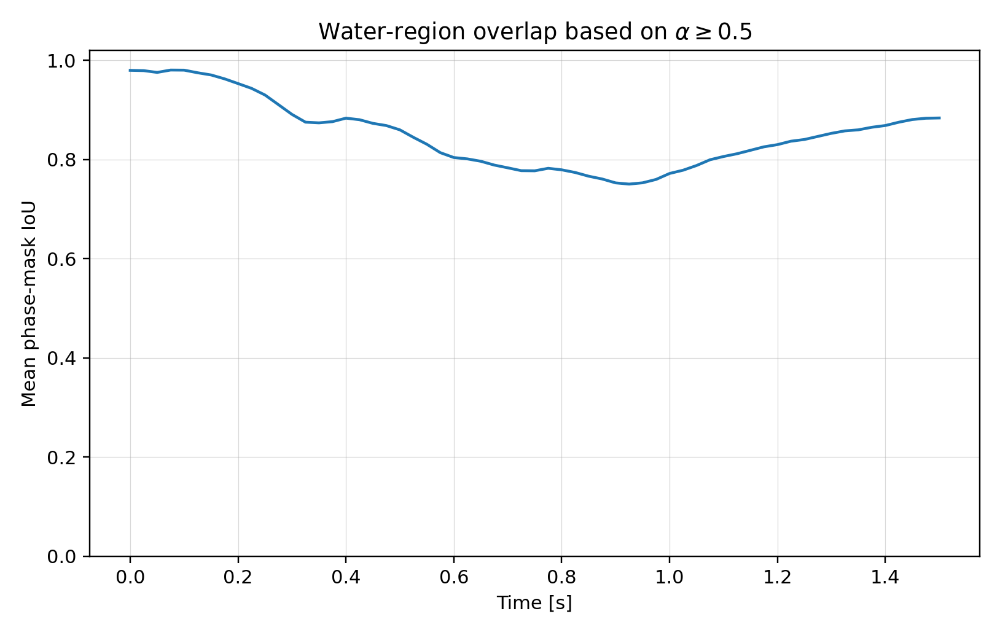

# Results

A walk-through of the study, with the headline numbers and the figures they
come from. Every surrogate is trained on the **343-case training grid** and
scored on the **60 off-grid validation geometries**, which appear in no
training step. nRMSE is the validation RMSE divided by the range of the
target over the validation cases.

---

## 1. The CFD database

The design varies the initial water-column height `H`, the obstacle height `h`
and the obstacle front position `x` (obstacle width fixed at 0.024 m). The
training design is a 7 × 7 × 7 full-factorial grid. The validation design is a
seeded Latin hypercube, nudged away from the grid wherever a point lands close
to a grid node in all three coordinates.

Each design point is generated from one base case (`cases/damBreak_template`)
by rewriting its `blockMeshDict`, `setFieldsDict` and `controlDict`, then run
for 1.5 s. All **403 of 403 runs completed**, every mesh passed `checkMesh`,
and metric extraction succeeded for every case. Each run stores 61 field
snapshots (every 0.025 s) and obstacle pressure histories every 0.005 s. The
full database is ~27 GB.

---

## 2. Impact metrics

Two `surfaceFieldValue` function objects record `p_rgh` and `alpha.water` on
the obstacle patch: the **area average** over the whole face, and the **local
maximum**. From each history the pipeline extracts:

| Metric | Definition | Why |
|---|---|---|
| Rolling peak (0.025 s / 0.050 s) | maximum of the moving-window mean pressure | a peak that is robust to single-sample spikes |
| Top-fraction mean (1 % / 5 %) | mean of the highest 1 % / 5 % of pressure samples | an alternative peak definition |
| Pressure impulse | ∫ max(p, 0) dt over the run | accumulated load |
| First distributed wetting time | first time the area-average `alpha.water` ≥ 0.5 | when the face is first substantially wet |

The raw single-sample maximum is also extracted but deliberately not used as a
surrogate target. It is set by isolated splash events and is the least
repeatable quantity in the database.

---

## 3. Scalar surrogates

For every target, 10 model families (polynomial ridge of degree 2 and 3, RBF
SVR, RBF kernel ridge, random forest, extra trees, gradient boosting,
distance-weighted KNN, and Gaussian processes with Matérn and RBF kernels) are
fitted on both the raw and the `log1p` target: 20 candidates per target. The
candidate with the lowest validation nRMSE is selected.

| Target | Selected model | Validation R² | Validation nRMSE |
|---|---|---:|---:|
| Local max, 0.050 s rolling peak | poly3 ridge (log) | **0.997** | 1.5 % |
| Local max, 0.025 s rolling peak | poly3 ridge | **0.984** | 3.2 % |
| Area-average pressure impulse | poly3 ridge (log) | **0.980** | 3.7 % |
| First distributed wetting time | Gaussian process (Matérn) | **0.974** | 5.3 % |
| Maximum-pressure impulse | KNN (log) | **0.967** | 4.1 % |
| Area-average, 0.050 s rolling peak | RBF SVR (log) | **0.938** | 6.2 % |
| Local max, top-5 % mean | poly3 ridge | 0.897 | 7.8 % |
| Area-average, top-5 % mean | poly3 ridge | 0.708 | 11.2 % |
| Area-average, 0.025 s rolling peak | KNN (log) | 0.578 | 13.4 % |
| Local max, top-1 % mean | KNN (log) | 0.304 | 16.2 % |
| Area-average, top-1 % mean | poly3 ridge | 0.147 | 21.4 % |

**The clearest result is about the targets, not the models.** Every
integrated or time-windowed load (impulses, 0.050 s rolling peaks) and the
wetting time is predicted to within a few percent of its range. Every
definition that leans on the few highest samples collapses: the area-average
top-1 % mean reaches only R² = 0.15. For the same pressure signal the ordering
is monotonic, from wider to narrower peak definitions (area average: 0.050 s
rolling 0.94 → 0.025 s rolling 0.58; top 5 % 0.71 → top 1 % 0.15). The
short-lived peak is a noisy, splash-driven quantity. Three geometric inputs
cannot determine it, however flexible the regression model.

No single family dominates: polynomial ridge is selected for 6 targets, KNN
for 3, and RBF SVR and a Gaussian process for one each. A cubic polynomial in
three inputs is enough for the smooth targets. KNN is selected where the
response is rough (the 1.0 training R² of the distance-weighted KNN is
interpolation of the training points, not a fit).

Response surfaces across the design space, and the surrogate-guided
best-design explorer:

  

  

Per-target parity and residual plots, and validation predictions for every
case, are in `results/surrogate_database/robust_surrogate_models/`.

---

## 4. POD field surrogate for the free surface

`alpha.water` from every snapshot is interpolated onto a common 96 × 96 grid.
An incremental PCA (POD) basis is fitted on the **20 923 training snapshots**
(343 cases × 61 times). For each of the 61 saved times, a 6-neighbour KNN maps
`(H, h, x)` to the 200 POD coefficients. A new geometry is reconstructed
snapshot by snapshot and scored against CFD on all **3 660 validation
snapshots** (60 cases × 61 times).

| POD modes | 50 | 100 | 150 | 200 |
|---|---:|---:|---:|---:|
| Cumulative explained variance | 83.3 % | 89.4 % | 92.1 % | **93.6 %** |

The spectrum decays slowly: 200 modes still leave 6.4 % of the variance,
because a sharp moving interface is not low-rank.

| Validation metric (60 cases, 3 660 snapshots) | Value |
|---|---:|
| Mean / median α-RMSE | 0.091 / 0.095 |
| 95th-percentile α-RMSE | 0.138 |
| Mean α-MAE | 0.029 |
| Mean water-region IoU (α ≥ 0.5) | 0.851 |
| Mean interface-front error | 0.084 m (95th pct 0.224 m) |
| Mean relative water-volume error | 1.8 % |

The error is not uniform in time. It is small while the column collapses,
rises steeply as the surge reaches the obstacle (t ≈ 0.15–0.35 s), and peaks
around t ≈ 0.9 s, after the first impact. The water-region overlap falls from
~0.98 to ~0.75 over the same period:

Across validation cases the mean α-RMSE ranges from 0.068
(`surrVal_021`, a low column far from the obstacle) to 0.132 (`surrVal_034`, a
high column close to it), consistent with the error concentrating where the
impact is most violent.

**Coefficient regressor.** Extra trees and KNN were compared for the
POD-coefficient map. Extra trees is marginally better on the mean
(α-RMSE 0.0897 vs 0.0912), KNN marginally better on the 95th percentile
(0.1378 vs 0.1386). The two differ by under 2 %, which suggests the error is dominated by the
POD basis rather than by the choice of regressor.

---

## 5. Summary of what works

- **Integrated and time-windowed loads**: impulses and 0.050 s rolling peaks
  are predicted to within 1.5–6.2 % of their range, and wetting time within
  5.3 %. These are the quantities a design study should use.
- **Instantaneous-style peaks**: top-1 % means and the shortest windows are
  not predictable from geometry alone (R² 0.15–0.58 in the area average).
  This reflects the physics of the splash, not a weak model.
- **Field reconstruction**: the POD surrogate captures the bulk surge and
  water volume (1.8 % volume error, IoU 0.85). It smooths the interface where
  the impact happens, which is exactly where the load is generated.

---

## 6. Reproducibility and caveats

- **Deterministic design and case generation.** The test suite regenerates
  the 343-case grid and the 60-case LHS design exactly from their seed. It
  also regenerates the committed template's `blockMeshDict`, `setFieldsDict`
  and `controlDict` byte for byte from the design table.
- **Committed metrics.** The per-case CFD metrics are committed, so the
  scalar surrogates can be re-trained without OpenFOAM or the database.
  Re-training them on a current stack (Python 3.13, scikit-learn 1.9,
  numpy 2.5) against the original (scikit-learn 0.23) selects **the same
  model for all 11 targets**. The selected validation R² values agree to
  within 1.1 × 10⁻⁴, and across all 220 candidate fits the largest change is
  0.002.
- **Selection on the validation set.** The model for each target is selected
  by validation nRMSE, and that same score is reported. With 20 candidates per
  target the reported R² values are mildly optimistic. There is no third,
  untouched test set.
- **Curated field diagnostics.** The error-over-time, IoU, interface-error and
  regressor-comparison figures and tables in `docs/figures/` and
  `results/final_project_outputs/` are curated outputs. The script that
  produced them is not part of the repository, so they cannot be regenerated
  from `scripts/` alone.
- **Environment.** The committed results were produced with OpenFOAM v2312 on
  Ubuntu 22.04 (WSL) with that distribution's Python packages (numpy 1.21,
  scipy 1.8, scikit-learn 0.23, matplotlib 3.5).
